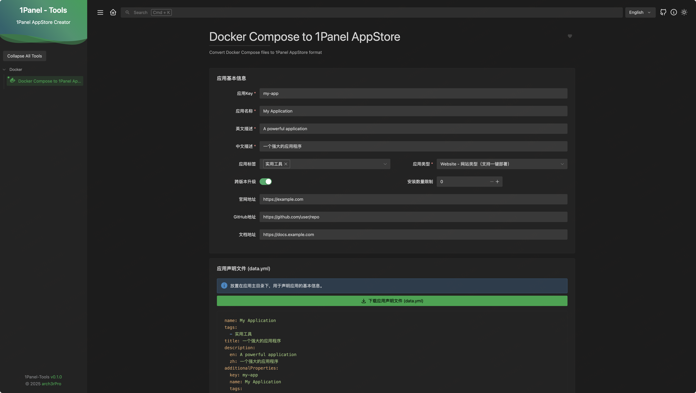

# 1Panel-Tools

[English](README_en.md) ｜ [Chinese](README.md)
## Overview

1Panel-Tools is a specialized toolkit designed to simplify the process of creating applications for the 1Panel AppStore. The primary tool in this collection is the Docker Compose to 1Panel AppStore converter, which transforms standard Docker Compose files into the format required by the 1Panel AppStore.

 
## Features

- **Docker Compose Conversion**: Automatically convert Docker Compose files to 1Panel AppStore format
- **Parameter Configuration**: Easily define and manage application parameters
- **Metadata Management**: Set application name, description, tags, and other metadata
- **Multi-language Support**: Configure descriptions in both English and Chinese
- **Export Functionality**: Download the converted files ready for 1Panel AppStore submission

## Getting Started

### Prerequisites

- Node.js (v14 or higher)
- pnpm (v9.11.0 or higher)

### Installation

```bash
# Clone the repository
git clone https://github.com/arch3rPro/1Panel-Tools.git
cd 1Panel-Tools

# Install dependencies
pnpm install

# Start the development server
pnpm dev
```

The application will automatically redirect to the Docker Compose to 1Panel AppStore converter tool.

## Usage

1. **Input Docker Compose**: Paste your Docker Compose file into the editor
2. **Configure Application**: Set the application name, key, description, and other metadata
3. **Define Parameters**: Add parameters for your application (ports, environment variables, etc.)
4. **Preview Conversion**: Review the generated 1Panel AppStore files
5. **Export**: Download the converted files for use with 1Panel AppStore

### Docker Usage

#### Using Docker Run

```bash
# Pull and run the Docker image
docker run -d --name 1panel-tools -p 8080:8080 vuldocker/1panel-tools:latest
```

Access the tool at http://localhost:8080

#### Using Docker Compose

Use `docker-compose.yml` file with the following content and set port:

```yaml
version: '3'
services:
  1panel-tools:
    image: vuldocker/1panel-tools:latest
    container_name: 1panel-tools
    ports:
      - "8080:80"
    restart: unless-stopped
```

Then run:

```bash
docker-compose up -d
```

Access the tool at http://localhost:8080

## 1Panel AppStore Format

The converter generates files following the 1Panel AppStore format:

```
├── app-key/
    ├── logo.png
    ├── data.yml
    ├── README.md
    └── version/
        ├── data.yml
        ├── docker-compose.yml
        └── scripts/
```

## License

This project is licensed under the GNU GPLv3 License - see the LICENSE file for details.

## Acknowledgements

- Based on the IT-Tools project framework
- Designed specifically for 1Panel AppStore application development